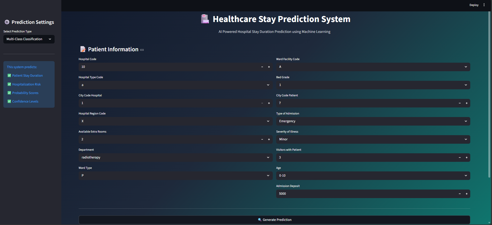
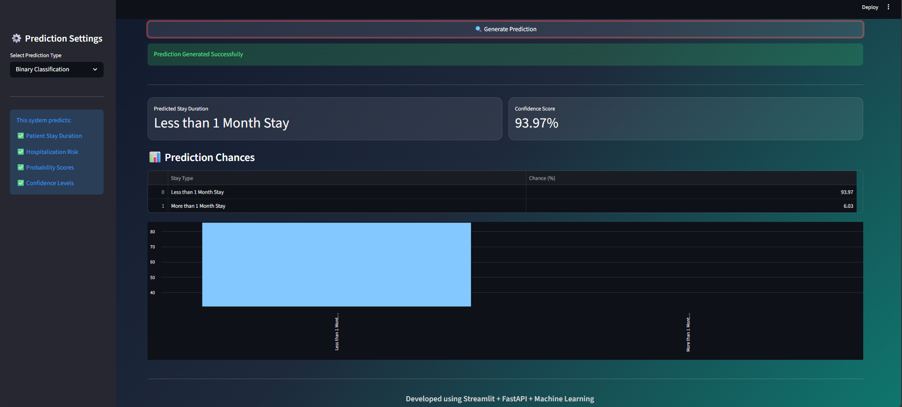
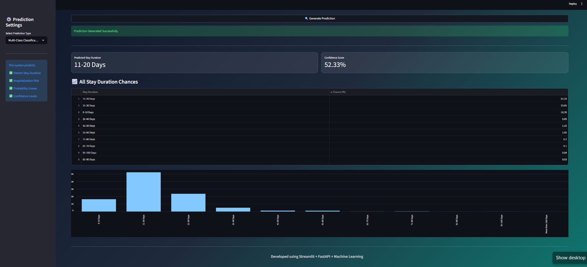

# 🏥 Hospital Stay Duration Prediction System

> **End-to-End Machine Learning System** — Binary & Multi-Class Classification with FastAPI Backend + Streamlit Frontend


---

## 📌 Project Overview

Hospitals often struggle with **resource planning, bed allocation, and staffing** due to unpredictable patient stays. This project builds a production-ready ML system that predicts **how long a patient will stay in hospital** — both as a binary decision *(short vs long stay)* and as a fine-grained 11-class duration bucket *(e.g., 0–10 days, 11–20 days, …, 100+ days)*.

The system is fully deployed via a **FastAPI REST backend** and an interactive **Streamlit web UI**, making it ready for real-world clinical or operational integration.

---

## 🗂️ Table of Contents

- [Problem Statement](#-problem-statement)
- [Dataset](#-dataset)
- [Project Architecture](#-project-architecture)
- [Notebooks & Modeling Workflow](#-notebooks--modeling-workflow)
- [Model Pipeline Design](#-model-pipeline-design)
- [API Reference](#-api-reference)
- [Streamlit UI](#-streamlit-ui)
- [Tech Stack](#-tech-stack)
- [Project Structure](#-project-structure)
- [Setup & Run](#-setup--run)
- [Results Summary](#-results-summary)
- [Key Learnings](#-key-learnings)

---

## 🎯 Problem Statement

**Goal:** Predict the length of a patient's hospital stay at the time of admission using administrative and clinical features — before a single day of treatment occurs.

**Why it matters:**
- Enables proactive **bed management** and **staff scheduling**
- Helps hospitals flag high-risk *long-stay* admissions early
- Supports insurance and billing teams with accurate duration estimates
- Provides actionable insights for healthcare operations research

---

## 📊 Dataset

| Property | Detail |
|---|---|
| **File** | `HealthCareAnalytics.csv` |
| **Records** | ~318,000 patient admissions |
| **Features** | 18 columns (15 input features + identifiers + target) |
| **Target** | `Stay` — 11 duration buckets: `0-10`, `11-20`, ..., `91-100`, `More than 100 Days` |
| **Source** | Healthcare Analytics dataset (multi-hospital, multi-region) |

### Feature Overview

| Feature | Type | Description |
|---|---|---|
| `Hospital_code` | Numeric | Unique hospital identifier |
| `Hospital_type_code` | Categorical | Type of hospital (a–g) |
| `City_Code_Hospital` | Numeric | City code where hospital is located |
| `Hospital_region_code` | Categorical | Region of hospital (X, Y, Z) |
| `Available_Extra_Rooms_in_Hospital` | Numeric | Spare bed capacity at admission time |
| `Department` | Categorical | Treating department (radiotherapy, surgery, etc.) |
| `Ward_Type` | Categorical | Ward classification (P–U) |
| `Ward_Facility_Code` | Categorical | Facility grade of the ward (A–F) |
| `Bed_Grade` | Ordinal | Quality grade of the assigned bed (1–4) |
| `City_Code_Patient` | Numeric | City code of the patient's residence |
| `Type_of_Admission` | Categorical | Emergency / Trauma / Urgent |
| `Severity_of_Illness` | Categorical | Minor / Moderate / Extreme |
| `Visitors_with_Patient` | Numeric | Number of accompanying visitors |
| `Age` | Categorical Bin | Patient age group (0-10 to 91-100) |
| `Admission_Deposit` | Numeric | Deposit amount paid at admission |

---

## 🏗️ Project Architecture

```
HealthCareAnalytics.csv
        │
        ▼
┌─────────────────────────────────────────┐
│         Exploratory Data Analysis        │
│  Multi_classification_pred.ipynb        │
│  • Null analysis, class distribution    │
│  • Pivot tables by Severity, Dept, Age  │
│  • Correlation heatmap, profiling       │
└─────────────┬───────────────────────────┘
              │
    ┌─────────┴──────────┐
    ▼                    ▼
Binary Model         Multi-Class Model       Unsupervised
(binary_pred.ipynb)  (multi_pred.ipynb)      (Unsupervised.ipynb)
 XGBoost             CatBoost / XGBoost      UMAP + HDBSCAN
 Binary Pipeline     11-class Pipeline       KMeans (k=11)
    │                    │
    ▼                    ▼
healthcare_Binary_pipeline.joblib
Healthcare_Multiclass_pipeline.joblib
              │
              ▼
        api.py (FastAPI)
        POST /predict/binary
        POST /predict/multiclass
              │
              ▼
        app.py (Streamlit UI)
```

---

## 📓 Notebooks & Modeling Workflow

### 1. `Binary_classification_pred.ipynb` — Binary Classification

**Objective:** Predict if a patient stays **< 1 month** (Class 0) or **≥ 1 month** (Class 1).

**Target encoding logic:**
```
Short Stay (Class 0): 0-10, 11-20, 21-30 days
Long Stay  (Class 1): 31-40, 41-50, ... More than 100 Days
```

**Modeling steps:**
- Baseline with `RandomForestClassifier` (200 estimators)
- Final model: `XGBClassifier` with tuned hyperparameters
- Full sklearn `Pipeline` with preprocessing embedded

**XGBoost configuration:**
```python
XGBClassifier(
    n_estimators=500, learning_rate=0.05,
    max_depth=5, min_child_weight=5, gamma=1,
    subsample=0.8, colsample_bytree=0.8,
    reg_alpha=1, reg_lambda=3,
    objective='binary:logistic', eval_metric='logloss'
)
```

---

### 2. `Multi_classification_pred.ipynb` — 11-Class Classification

**Objective:** Predict exact stay duration bucket across 11 classes.

**EDA highlights:**
- Pivot tables: Stay distribution by `Severity_of_Illness`, `Department`, `Hospital_region_code`, `Ward_Type`
- YData Profiling report for automated EDA
- Correlation heatmap on numerical features

**Modeling steps:**
- `LabelEncoder` on target → ordinal class labels 0–10
- `TargetEncoder` for all categorical features (high-cardinality friendly)
- `StandardScaler` on `Admission_Deposit`
- `compute_sample_weight(class_weight='balanced')` to handle class imbalance
- `RandomizedSearchCV` (20 iterations, 3-fold CV) for XGBoost hyperparameter tuning
- Final model serialized via `joblib`

---

### 3. `Unsupervised.ipynb` — Clustering Analysis

**Objective:** Discover natural patient segments without using the Stay label.

**Pipeline:**
1. Missing value imputation (mode for categoricals, median for numericals)
2. `TargetEncoder` for categorical features
3. `RobustScaler` for numeric features (outlier-resistant)
4. **UMAP** dimensionality reduction → 10 components
5. **HDBSCAN** density-based clustering (`min_cluster_size=500`)
6. **KMeans** (k=11) as a comparison baseline

**Evaluation metrics:**
- Silhouette Score
- Davies-Bouldin Score
- Calinski-Harabasz Score

**Key insight:** Unsupervised cluster structure was compared against the 11 supervised stay buckets to validate whether natural patient groupings align with clinical duration labels.

---

## 🔧 Model Pipeline Design

Both production models are saved as **end-to-end sklearn Pipelines** — input goes in raw, predictions come out. No separate preprocessing step at inference time.

### Binary Pipeline
```
Raw Input DataFrame
    └─► ColumnTransformer
            ├─ TargetEncoder       → [Hospital_code, City_Code_Patient]
            ├─ OneHotEncoder       → [Hospital_type_code, City_Code_Hospital,
            │                         Hospital_region_code, Department,
            │                         Ward_Type, Ward_Facility_Code,
            │                         Bed_Grade, Type_of_Admission,
            │                         Severity_of_Illness, Age]
            ├─ MinMaxScaler        → [Available_Extra_Rooms, Admission_Deposit]
            └─ StandardScaler      → [Visitors_with_Patient]
    └─► XGBClassifier (binary:logistic)
    └─► Prediction (0 or 1) + Probabilities
```

### Multi-Class Pipeline
```
Raw Input DataFrame
    └─► ColumnTransformer
            ├─ TargetEncoder       → all categorical columns
            └─ StandardScaler      → [Admission_Deposit]
    └─► XGBClassifier (multi:softprob, 11 classes)
    └─► Prediction (0–10) + All Class Probabilities
```

---

## 🚀 API Reference

The FastAPI backend exposes a single unified endpoint for both models.

**Start the API:**
```bash
uvicorn api:app --reload
```

### `POST /predict/{model_type}`

`model_type` is either `binary` or `multiclass`.

**Request Body:**
```json
{
  "Hospital_code": 10,
  "Hospital_type_code": "a",
  "City_Code_Hospital": 1,
  "Hospital_region_code": "X",
  "Available_Extra_Rooms_in_Hospital": 2,
  "Department": "radiotherapy",
  "Ward_Type": "R",
  "Ward_Facility_Code": "C",
  "Bed_Grade": 2.0,
  "City_Code_Patient": 7.0,
  "Type_of_Admission": "Emergency",
  "Severity_of_Illness": "Moderate",
  "Visitors_with_Patient": 3,
  "Age": "41-50",
  "Admission_Deposit": 5000
}
```

**Binary Response:**
```json
{
  "prediction": 1,
  "confidence_score": 82.34,
  "probabilities": {
    "Class_0": 17.66,
    "Class_1": 82.34
  }
}
```

**Multi-Class Response:**
```json
{
  "prediction": 2,
  "confidence_score": 45.12,
  "all_class_probabilities": {
    "0": 5.1, "1": 12.3, "2": 45.12, "3": 18.4, ...
  }
}
```

Interactive Swagger docs available at: **`http://127.0.0.1:8000/docs`**

---

## 🖥️ Streamlit UI

**Start the UI (after the API is running):**
```bash
streamlit run app.py
```

**Features:**
- Sidebar toggle between **Binary** and **Multi-Class** prediction modes
- Two-column patient input form with all 15 features
- Real-time prediction with confidence score metric
- Probability breakdown table + bar chart visualization
- Dark gradient UI theme (teal/slate)

**Label mappings displayed to user:**

| Binary | Multi-Class |
|---|---|
| Class 0 → *Less than 1 Month Stay* | 0 → 0-10 Days |
| Class 1 → *More than 1 Month Stay* | 1 → 11-20 Days, ... 10 → More than 100 Days |


## 🖼️ Application Screenshots

### Patient Input Form


### Binary Classification Result
> Predicts **Less than 1 Month Stay** with **93.97% confidence**



### Multi-Class Classification Result
> Predicts **11-20 Days** stay with full probability breakdown across all 11 buckets



---

## 🛠️ Tech Stack

| Layer | Technology |
|---|---|
| Data Processing | `pandas`, `numpy` |
| ML Models | `scikit-learn`, `xgboost`, `catboost` |
| Feature Encoding | `TargetEncoder`, `OneHotEncoder`, `MinMaxScaler`, `StandardScaler`, `RobustScaler` |
| Dimensionality Reduction | `umap-learn` |
| Clustering | `hdbscan`, `sklearn.cluster.KMeans` |
| Model Serialization | `joblib` |
| API Backend | `FastAPI`, `uvicorn`, `pydantic` |
| Frontend | `Streamlit` |
| EDA | `matplotlib`, `seaborn`, `ydata-profiling` |

---

## 📁 Project Structure

```
Hospital stay prediction/
│
├── 📓 Binary_classification_pred.ipynb     # Binary model: EDA + training + pipeline
├── 📓 Multi_classification_pred.ipynb      # Multi-class model: EDA + training + tuning
├── 📓 Unsupervised.ipynb                   # Clustering with UMAP + HDBSCAN + KMeans
│
├── 🐍 api.py                               # FastAPI backend with /predict endpoints
├── 🐍 app.py                               # Streamlit frontend UI
│
├── 💾 healthcare_Binary_pipeline.joblib    # Saved binary classification pipeline (~1.2 MB)
├── 💾 Healthcare_Multiclass_pipeline.joblib # Saved multi-class pipeline (~37 MB)
│
├── 📊 HealthCareAnalytics.csv              # Raw dataset (~318K rows, 18 columns)
├── 📋 requirements.txt                     # Python dependencies
│
└── catboost_info/                          # CatBoost training logs (auto-generated)
```

---

## ⚙️ Setup & Run

### 1. Clone the repository
```bash
git clone https://github.com/ENGABHAY/hospital-stay-prediction.git
cd hospital-stay-prediction
```

### 2. Create a virtual environment
```bash
python -m venv venv
venv\Scripts\activate           # Windows
```

### 3. Install dependencies
```bash
pip install -r requirements.txt
```

### 4. Start the FastAPI backend
```bash
uvicorn api:app --reload
# API running at: http://127.0.0.1:8000
# Swagger UI at:  http://127.0.0.1:8000/docs
```

### 5. Start the Streamlit frontend (new terminal)
```bash
streamlit run app.py
# UI running at: http://localhost:8501
```

> ⚠️ The Streamlit app calls the FastAPI backend at `http://127.0.0.1:8000` — both must be running simultaneously.

---

## 📈 Results Summary

| Model | Task | Algorithm | Key Config |
|---|---|---|---|
| Binary Classifier | Short vs Long Stay | XGBoost | 500 trees, lr=0.05, depth=5, L1+L2 reg |
| Multi-Class Classifier | 11 Stay Buckets | XGBoost | RandomizedSearchCV tuned, sample_weight balanced |
| Clustering | Patient Segmentation | UMAP + HDBSCAN | 10 UMAP dims, min_cluster_size=500 |
| Clustering (baseline) | Patient Segmentation | KMeans | k=11, matching supervised classes |

Both supervised models are deployed as sklearn pipelines with embedded preprocessing — **zero data leakage**, production-safe, single `.predict()` call at inference.

---

## 💡 Key Learnings

- **TargetEncoder over OneHotEncoder** for high-cardinality features like `Hospital_code` significantly reduces dimensionality while encoding target-relevant signal.
- **Class imbalance** in multi-class stay duration is handled via `compute_sample_weight('balanced')` rather than resampling, preserving dataset integrity.
- **Pipeline-first design** ensures that preprocessing is version-locked with the model — no risk of train/serve skew.
- **UMAP + HDBSCAN** proved more effective than KMeans for discovering non-spherical patient clusters, though the 11-cluster KMeans provided useful comparison against supervised labels.
- Separating the **API layer (FastAPI)** from the **UI layer (Streamlit)** makes the system modular — the API can serve any frontend, mobile app, or downstream system independently.

---

## 🤝 Contributing

Pull requests are welcome. For major changes, please open an issue first to discuss what you'd like to change.

---


---

<div align="center">
  <strong>Built with Python · Scikit-Learn · XGBoost · FastAPI · Streamlit</strong>
</div>

📄 License
This project is licensed under the MIT License.